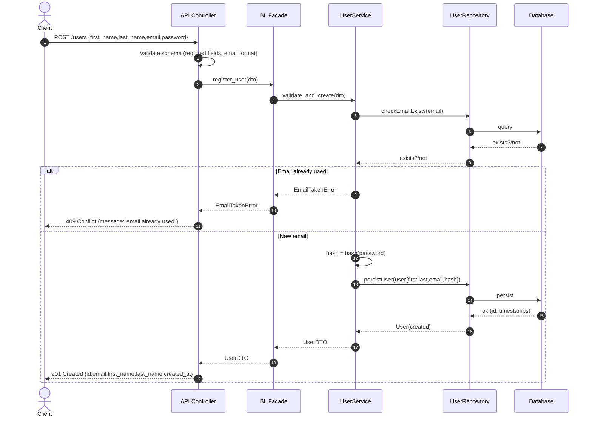
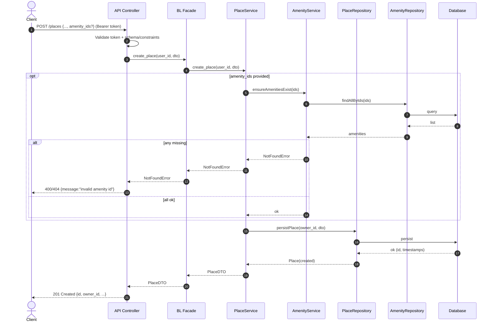
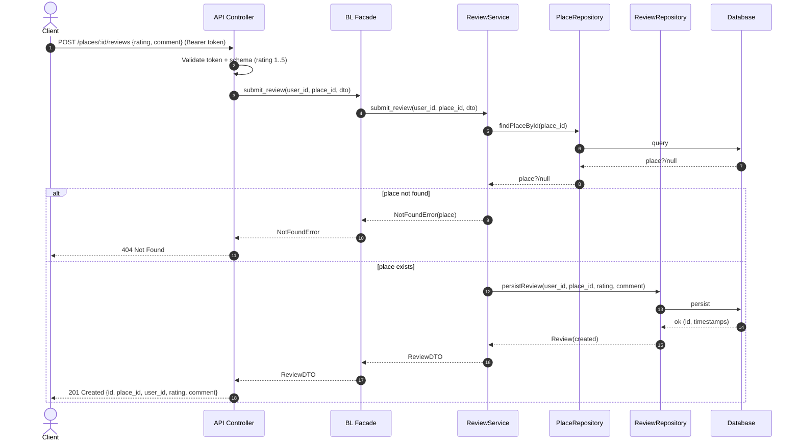
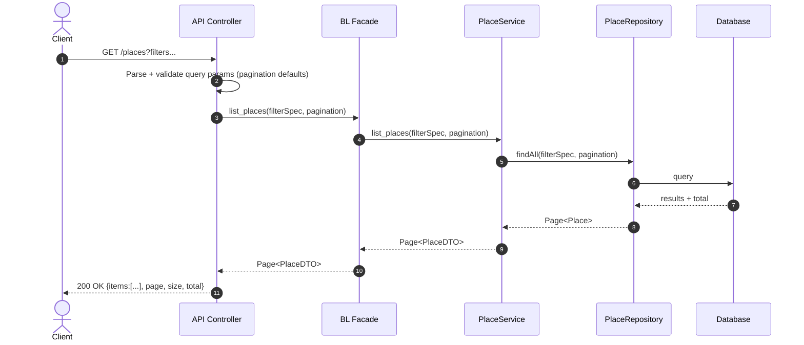

# Sequence Diagrams

## 1) User Registration

**Explanatory Notes:**  
API call for registers a new user in the system.  
- **Presentation Layer:** Receives the POST request, validates the JSON schema for required fields and email format. Passes the validated data to the Business Logic Layer through the Facade.  
- **Business Logic Layer:** The Facade delegates to `UserService`, which checks if the email already exists. If it does, it returns a 409 Conflict. If not, it hashes the password and prepares a new user entity.  
- **Persistence Layer:** `UserRepository` checks email uniqueness, then persists the user in the database with timestamps.  
The diagram shows both the failure path (duplicate email) and the success path (user creation and returning a 201 Created response).

---

## 2) Place Creation

**Explanatory Notes:**  
API call for creates a new place owned by the authenticated user.  
- **Presentation Layer:** Validates the bearer token, ensures schema constraints (price, location), and forwards data to the Facade.  
- **Business Logic Layer:** The Facade calls `PlaceService`. If amenity IDs are provided, `AmenityService` verifies their existence. Missing amenities trigger a 400/404 error; otherwise, the place is created.  
- **Persistence Layer:** `PlaceRepository` persists the place. `AmenityRepository` is used to validate amenity IDs.  
The diagram shows optional amenity validation, error handling, and the success path returning a 201 Created.

---

## 3) Review Submission

**Explanatory Notes:**  
API call for submits a new review for a place.  
- **Presentation Layer:** Validates authentication token and review schema (rating range). Passes data to the Business Logic Layer via the Facade.  
- **Business Logic Layer:** The Facade calls `ReviewService`, which checks if the place exists. If not, it returns 404; otherwise, it persists the review.  
- **Persistence Layer:** `PlaceRepository` verifies place existence; `ReviewRepository` saves the review.  
The diagram includes both the failure path (place not found) and the success path (review created and returned in the response).

---

## 4) Fetching a List of Places

**Explanatory Notes:**  
API call for retrieves a filtered, paginated list of places.  
- **Presentation Layer:** Parses query parameters, validates them, sets default pagination, and sends request to the Facade.  
- **Business Logic Layer:** The Facade delegates to `PlaceService`, which retrieves the list from the repository and converts entities to DTOs.  
- **Persistence Layer:** `PlaceRepository` queries the database using the filter specification and pagination settings, returning results with total count.  
The diagram shows the complete flow from request parsing to returning the final paginated list with a 200 OK response.

