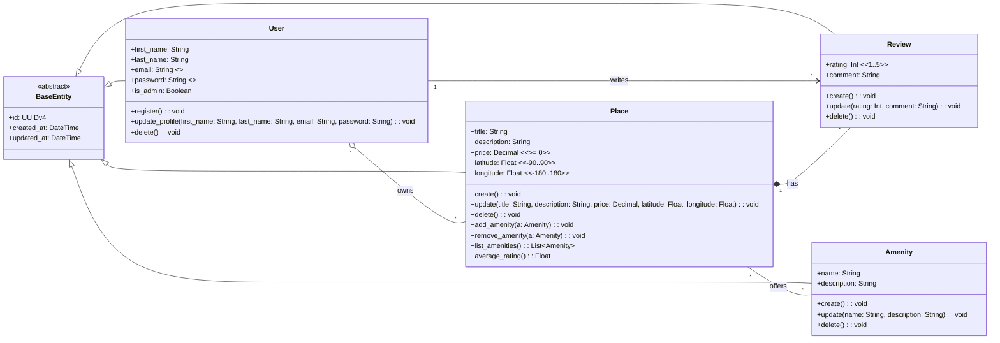

# HBnB Evolution - Business Logic Layer Class Diagram

## Entity Overview

### **BaseEntity** (Abstract)
**Role:** Foundation class providing common audit fields and unique identification for all domain entities.
- **Key Attributes:** `id` (UUIDv4), `created_at`, `updated_at`
- **Purpose:** Ensures DRY principle and consistent entity structure across the system

### **User**
**Role:** Represents registered users who can create places and write reviews.
- **Key Attributes:** `email` (unique identifier), `password` (hashed), `is_admin` (privileges)
- **Key Methods:** `register()`, `update_profile()`, `delete()`
- **Business Rules:** Unique email validation, secure password storage

### **Place**
**Role:** Property listings created by users with location and pricing information.
- **Key Attributes:** `title`, `description`, `price` (≥0), `latitude/longitude` (valid ranges)
- **Key Methods:** `create()`, `update()`, `add_amenity()`, `average_rating()`
- **Business Rules:** Non-negative pricing, valid geolocation coordinates

### **Review**
**Role:** User feedback and ratings for places.
- **Key Attributes:** `rating` (1-5 scale), `comment`
- **Key Methods:** `create()`, `update()`, `delete()`
- **Business Rules:** Rating within valid range, one review per user per place

### **Amenity**
**Role:** Reusable features/services that can be associated with multiple places.
- **Key Attributes:** `name` (ideally unique), `description`
- **Key Methods:** `create()`, `update()`, `delete()`
- **Business Rules:** Avoid duplicate names, deletion removes associations only

## Relationships

### **Ownership & Authorship**
- **User → Place** (1:*): Users own multiple places; places can be transferred between users
- **User → Review** (1:*): Users write multiple reviews; each review has one author

### **Composition**
- **Place → Review** (1:*): Places contain reviews; deleting a place removes all its reviews

### **Many-to-Many Association**
- **Place ↔ Amenity** (*:*): Places offer multiple amenities; amenities are shared across places

### **Business Logic Impact**
The relationships support core business operations:
- **Property management:** Users create and manage their place listings
- **Quality assurance:** Reviews provide feedback mechanism tied to specific places
- **Feature standardization:** Shared amenities enable consistent property descriptions
- **Data integrity:** Composition ensures orphaned reviews don't exist; aggregation allows ownership transfers
