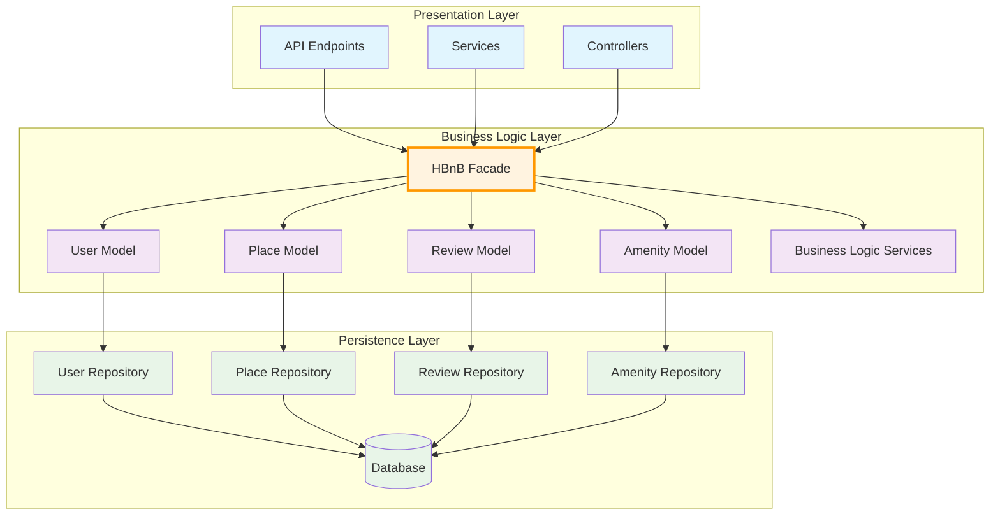

# High-Level Package Diagram - HBnB Application

## Package Diagram

## Layer Descriptions

### 1. Presentation Layer (Services, API)
**Responsibilities:**
- Handles HTTP requests and responses
- Manages API endpoints for user interactions
- Provides RESTful services for external consumption
- Handles authentication and authorization
- Input validation and output formatting

**Components:**
- **API Endpoints**: Define the REST API structure for user registration, place management, reviews, and amenities
- **Services**: Business service interfaces that orchestrate API operations
- **Controllers**: Handle HTTP request routing and response management

### 2. Business Logic Layer (Models)
**Responsibilities:**
- Contains core business rules and logic
- Defines entity models and their relationships
- Implements business validation and processing
- Manages entity lifecycle and state transitions

**Components:**
- **HBnB Facade**: Central interface that simplifies interactions between layers (Facade Pattern)
- **User Model**: Manages user entities, registration, profile updates, and user types
- **Place Model**: Handles property listings, location data, and amenity associations
- **Review Model**: Manages user reviews, ratings, and review validation
- **Amenity Model**: Defines and manages amenities that can be associated with places
- **Business Logic Services**: Implements complex business operations and validations

### 3. Persistence Layer
**Responsibilities:**
- Manages data storage and retrieval
- Provides database abstraction
- Handles CRUD operations for all entities
- Manages database connections and transactions

**Components:**
- **Repository Classes**: Data access objects for each entity (User, Place, Review, Amenity)
- **Database**: Physical data storage system

## Facade Pattern Implementation

The **HBnB Facade** serves as the central interface that:
- Simplifies communication between the Presentation and Business Logic layers
- Provides a unified API for complex business operations
- Encapsulates business logic complexity from the presentation layer
- Coordinates interactions between multiple business models
- Ensures consistent business rule application across all operations

## Communication Flow

1. **Client Request**: External clients send HTTP requests to the Presentation Layer
2. **API Processing**: Controllers and Services in the Presentation Layer receive and validate requests
3. **Facade Interaction**: The Presentation Layer communicates with the Business Logic Layer exclusively through the HBnB Facade
4. **Business Logic Execution**: The Facade coordinates with appropriate Models and Business Logic Services
5. **Data Persistence**: Business Models interact with their respective Repository classes
6. **Database Operations**: Repositories perform CRUD operations on the Database
7. **Response Chain**: Results flow back through the same layers to provide responses to clients

This architecture ensures separation of concerns, maintainability, and scalability while providing a clear interface for system interactions through the facade pattern.