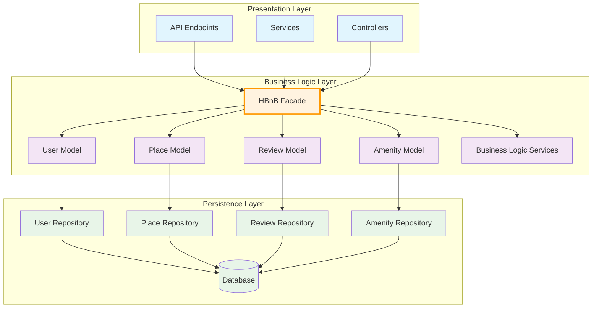
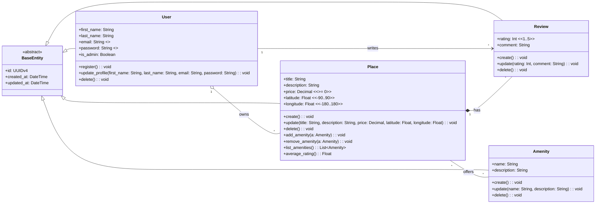
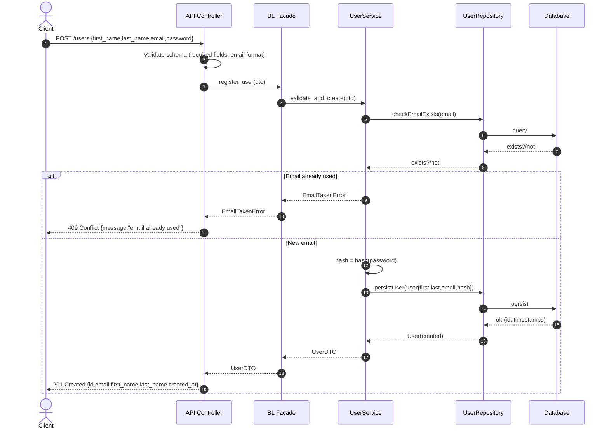
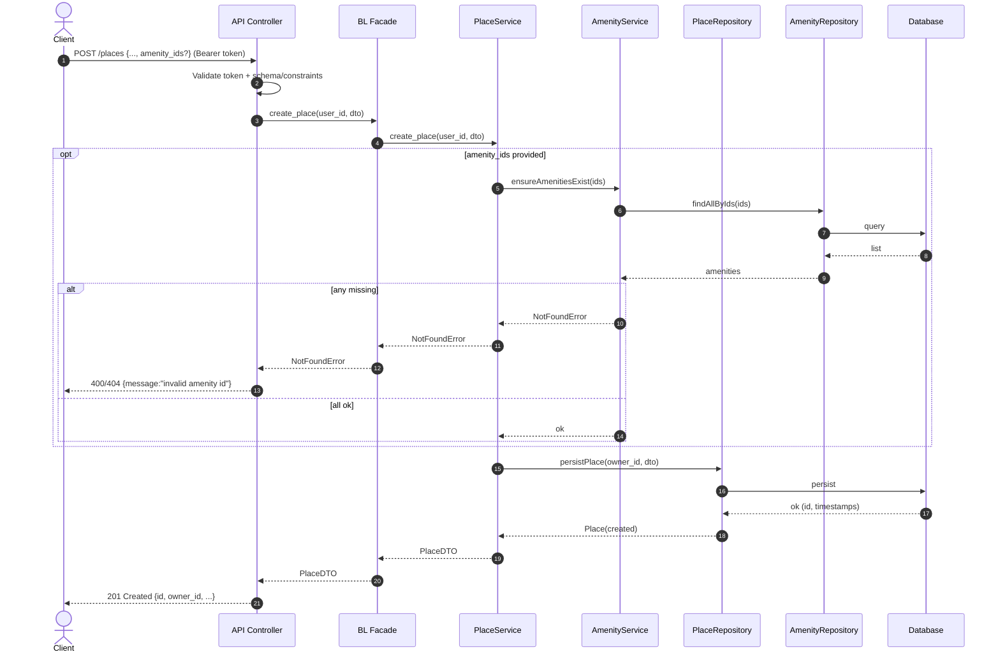
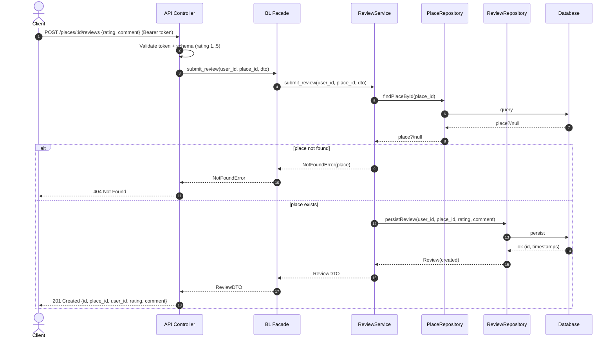
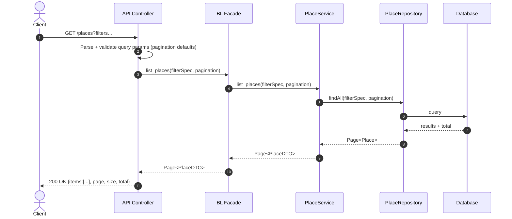

# HBnB Evolution - Technical Documentation

## Table of Contents
1. [Introduction](#introduction)
2. [High-Level Architecture](#high-level-architecture)
3. [Business Logic Layer](#business-logic-layer)
4. [API Interaction Flow](#api-interaction-flow)
5. [Conclusion](#conclusion)

---

## Introduction

### Project Overview
The HBnB Evolution application is a simplified version of an AirBnB-like platform that enables users to manage property listings, submit reviews, and interact with amenities. This technical document serves as a comprehensive blueprint for the system's architecture and design, providing detailed UML diagrams and explanations to guide the implementation phases.

### Document Purpose
This document consolidates all architectural diagrams and design decisions into a single reference that:
- Illustrates the three-layer architecture implementation
- Details the core business logic entities and their relationships
- Documents API interaction flows for key use cases
- Provides explanatory notes for design decisions and patterns used
- Serves as a foundation for development teams during implementation

### System Requirements Overview
The HBnB Evolution application supports four primary operations:
1. **User Management**: Registration, profile updates, and administrative roles
2. **Place Management**: Property listing creation with location and amenity details
3. **Review Management**: User feedback and rating system for places
4. **Amenity Management**: Reusable features that can be associated with places

---

## High-Level Architecture

### Architecture Overview
The HBnB application follows a layered architecture pattern divided into three distinct layers, with communication facilitated through the facade design pattern. This approach ensures separation of concerns, maintainability, and scalability.

### Package Diagram

### Layer Descriptions

#### 1. Presentation Layer (Services, API)
**Purpose**: Handles external communication and user interface interactions.

**Responsibilities**:
- HTTP request/response processing
- RESTful API endpoint management
- Authentication and authorization
- Input validation and output formatting
- Client communication protocols

**Key Components**:
- **API Endpoints**: Define REST API structure for all user operations
- **Services**: Business service interfaces for operation orchestration
- **Controllers**: HTTP request routing and response management

**Design Decisions**:
- RESTful design principles for intuitive API usage
- Stateless communication for scalability
- Centralized authentication handling
- Standardized error response formats

#### 2. Business Logic Layer (Models)
**Purpose**: Contains the core business rules, validation, and domain logic.

**Responsibilities**:
- Entity model definitions and relationships
- Business rule enforcement and validation
- Complex operation coordination
- State management and lifecycle control
- Domain-specific logic implementation

**Key Components**:
- **HBnB Facade**: Central interface implementing the facade pattern
- **Entity Models**: User, Place, Review, and Amenity domain objects
- **Business Logic Services**: Complex business operation implementations

**Design Decisions**:
- Facade pattern for simplified layer communication
- Rich domain models with embedded business logic
- Centralized validation rules
- Entity relationship management

#### 3. Persistence Layer
**Purpose**: Manages data storage, retrieval, and persistence operations.

**Responsibilities**:
- Database abstraction and connection management
- CRUD operations for all entities
- Data integrity and transaction management
- Query optimization and data access patterns

**Key Components**:
- **Repository Classes**: Data access objects for each entity type
- **Database**: Physical data storage system

**Design Decisions**:
- Repository pattern for data access abstraction
- Centralized database connection management
- Consistent CRUD operation interfaces
- Separation of data access from business logic

### Facade Pattern Implementation

The **HBnB Facade** serves as the architectural cornerstone that:

**Simplifies Communication**: Provides a single, unified interface between the Presentation and Business Logic layers, reducing coupling and complexity.

**Encapsulates Complexity**: Hides the intricate details of business logic coordination from the presentation layer, making the system easier to understand and maintain.

**Centralizes Control**: Coordinates interactions between multiple business models and services, ensuring consistent business rule application across all operations.

**Enables Flexibility**: Allows for changes in business logic implementation without affecting the presentation layer, supporting system evolution and maintenance.

### Communication Flow

1. **Client Request Initiation**: External clients send HTTP requests to the Presentation Layer endpoints
2. **Request Processing**: Controllers and Services validate, authenticate, and prepare requests
3. **Facade Interaction**: All business logic access occurs exclusively through the HBnB Facade interface
4. **Business Logic Execution**: The Facade coordinates with appropriate Models and Business Logic Services
5. **Data Persistence**: Business Models interact with their corresponding Repository classes
6. **Database Operations**: Repositories execute CRUD operations on the Database
7. **Response Formation**: Results flow back through the same layers to provide structured responses to clients

This architecture ensures proper separation of concerns, maintainability, scalability, and provides a clear, documented interface for all system interactions.

---

## Business Logic Layer

### Class Diagram Overview
The Business Logic layer represents the core domain of the HBnB application, implementing the key entities and their relationships that drive the business operations.

### Detailed Class Diagram

### Entity Specifications

#### BaseEntity (Abstract Class)
**Purpose**: Provides foundational attributes and functionality for all domain entities.

**Key Attributes**:
- `id: UUIDv4` - Unique identifier ensuring global uniqueness
- `created_at: DateTime` - Audit trail for entity creation
- `updated_at: DateTime` - Audit trail for last modification

**Design Rationale**: Implements the DRY (Don't Repeat Yourself) principle by centralizing common attributes that all entities require. This ensures consistent identification and audit capabilities across the entire domain model.

#### User Entity
**Purpose**: Represents registered users who can create places and submit reviews.

**Key Attributes**:
- `first_name, last_name: String` - User identification information
- `email: String (unique)` - Primary authentication identifier
- `password: String (hashed)` - Secure authentication credential
- `is_admin: Boolean` - Administrative privilege flag

**Key Methods**:
- `register()` - User registration with validation
- `update_profile()` - Profile modification with constraints
- `delete()` - Account removal with cascading effects

**Business Rules**:
- Email uniqueness enforcement across the system
- Password hashing for security compliance
- Admin privileges for system management operations
- Profile validation for data integrity

#### Place Entity
**Purpose**: Represents property listings with location and pricing information.

**Key Attributes**:
- `title, description: String` - Property identification and details
- `price: Decimal (≥0)` - Non-negative pricing constraint
- `latitude: Float (-90..90)` - Valid geographic latitude
- `longitude: Float (-180..180)` - Valid geographic longitude

**Key Methods**:
- `create(), update(), delete()` - Standard CRUD operations
- `add_amenity(), remove_amenity()` - Amenity association management
- `list_amenities()` - Amenity retrieval for the place
- `average_rating()` - Calculated rating from all reviews

**Business Rules**:
- Geographic coordinate validation for mapping accuracy
- Non-negative pricing for business logic consistency
- Amenity association management for feature tracking
- Calculated fields for dynamic data representation

#### Review Entity
**Purpose**: Captures user feedback and ratings for places.

**Key Attributes**:
- `rating: Int (1..5)` - Standardized rating scale
- `comment: String` - Textual feedback from users

**Key Methods**:
- `create(), update(), delete()` - Standard CRUD operations

**Business Rules**:
- Rating constraint to 1-5 scale for consistency
- One review per user per place to prevent abuse
- Review ownership tied to user authentication
- Deletion cascading when parent place is removed

#### Amenity Entity
**Purpose**: Defines reusable features that can be associated with multiple places.

**Key Attributes**:
- `name: String` - Amenity identifier (ideally unique)
- `description: String` - Detailed amenity information

**Key Methods**:
- `create(), update(), delete()` - Standard CRUD operations

**Business Rules**:
- Name uniqueness to prevent duplication
- Reusability across multiple places
- Soft deletion to maintain referential integrity
- Standardized feature categorization

### Relationship Analysis

#### Ownership Relationships
**User → Place (1:*)**: 
- Users can own multiple properties
- Each place has exactly one owner
- Supports business model of property management
- Enables ownership transfer functionality

**User → Review (1:*)**: 
- Users can write multiple reviews
- Each review is authored by exactly one user
- Maintains accountability and authenticity
- Supports user reputation systems

#### Composition Relationships
**Place → Review (1:*)**: 
- Places contain multiple reviews
- Reviews cannot exist without a parent place
- Deleting a place removes all associated reviews
- Ensures data integrity and prevents orphaned records

#### Association Relationships
**Place ↔ Amenity (*:*)**: 
- Places can offer multiple amenities
- Amenities can be shared across multiple places
- Enables standardized feature management
- Supports flexible property descriptions

### Business Logic Impact

The entity relationships directly support core business operations:

**Property Management**: Users create and manage place listings with full ownership control and the ability to associate relevant amenities.

**Quality Assurance**: The review system provides a feedback mechanism tied to specific places, enabling reputation-based decision making.

**Feature Standardization**: Shared amenities ensure consistent property descriptions and enable effective search and filtering capabilities.

**Data Integrity**: Composition and association patterns ensure referential integrity while supporting business operations like ownership transfers and amenity management.

**Scalability**: The relationship design supports growth in users, places, and reviews while maintaining performance through proper indexing and query optimization strategies.

---

## API Interaction Flow

### Overview
The following sequence diagrams illustrate the step-by-step interaction between the three architectural layers for the four primary API operations. Each diagram shows how requests flow from the Presentation Layer through the Business Logic Layer to the Persistence Layer and back.

### 1. User Registration

**Operation Purpose**: Registers a new user in the system with validation and security measures.

**Layer Interactions**:
- **Presentation Layer**: Receives POST request, validates JSON schema for required fields and email format, handles HTTP status codes and error responses
- **Business Logic Layer**: Facade delegates to UserService for business logic, checks email uniqueness, implements password hashing for security
- **Persistence Layer**: UserRepository manages email existence checks and user persistence with automatic timestamp generation

**Key Features**:
- **Input Validation**: Schema validation at API level and business rule validation in the service layer
- **Security Implementation**: Password hashing before storage to ensure secure credential management
- **Error Handling**: Comprehensive error paths for duplicate email scenarios with appropriate HTTP status codes
- **Success Response**: Returns sanitized user information without sensitive data like passwords

### 2. Place Creation

**Operation Purpose**: Creates a new place listing owned by the authenticated user with optional amenity associations.

**Layer Interactions**:
- **Presentation Layer**: Validates bearer token for authentication, enforces schema constraints for price and location coordinates
- **Business Logic Layer**: Facade coordinates PlaceService and AmenityService, validates amenity existence before place creation
- **Persistence Layer**: PlaceRepository and AmenityRepository handle data persistence and validation queries

**Key Features**:
- **Authentication**: Bearer token validation ensures only authenticated users can create places
- **Optional Amenity Validation**: If amenity IDs are provided, system validates their existence before proceeding
- **Coordinate Validation**: Geographic latitude and longitude constraints ensure valid location data
- **Atomic Operations**: Place creation fails if any amenity IDs are invalid, ensuring data consistency

### 3. Review Submission

**Operation Purpose**: Submits a new review for a specific place with rating and comment.

**Layer Interactions**:
- **Presentation Layer**: Validates authentication token and review schema with rating range constraints
- **Business Logic Layer**: ReviewService validates place existence before allowing review creation
- **Persistence Layer**: PlaceRepository verifies place existence, ReviewRepository handles review persistence

**Key Features**:
- **Place Validation**: Ensures reviews can only be submitted for existing places
- **Rating Constraints**: Enforces 1-5 rating scale for consistency across the platform
- **Resource-Based URLs**: RESTful design with place ID in URL path for clear resource hierarchy
- **Error Handling**: Appropriate 404 response when attempting to review non-existent places

### 4. Fetching a List of Places

**Operation Purpose**: Retrieves a filtered and paginated list of places based on query parameters.

**Layer Interactions**:
- **Presentation Layer**: Parses query parameters, validates filter criteria, sets default pagination values
- **Business Logic Layer**: PlaceService processes filter specifications and coordinates data retrieval
- **Persistence Layer**: PlaceRepository executes optimized database queries with filtering and pagination

**Key Features**:
- **Flexible Filtering**: Support for various query parameters to filter places by different criteria
- **Pagination**: Built-in pagination with configurable page size and default values for performance
- **Performance Optimization**: Repository layer handles efficient database queries with proper indexing
- **Consistent Response Format**: Standardized paginated response structure with metadata

### API Design Principles

The sequence diagrams demonstrate several key architectural principles:

**Layered Communication**: All interactions follow the established layer boundaries with the Facade pattern serving as the central coordination point.

**Error Handling**: Each API operation includes comprehensive error handling with appropriate HTTP status codes and meaningful error messages.

**Security**: Authentication and authorization are consistently applied across operations that require user context.

**Data Validation**: Multiple levels of validation ensure data integrity from API schema validation to business rule enforcement.

**Performance Considerations**: Pagination, filtering, and optimized database queries support scalable operations.

**RESTful Design**: API endpoints follow REST conventions with appropriate HTTP methods and resource-based URLs.

---

## Conclusion

### Architecture Summary
The HBnB Evolution application implements a robust three-layer architecture that successfully separates concerns while maintaining clear communication pathways. The facade pattern serves as an effective interface between layers, simplifying interactions and enabling maintainable code organization.

### Design Strengths
1. **Scalability**: The layered architecture supports horizontal and vertical scaling through clear separation of concerns
2. **Maintainability**: Well-defined interfaces and the facade pattern make the system easy to modify and extend
3. **Security**: Proper authentication, authorization, and data validation ensure system security
4. **Data Integrity**: Comprehensive entity relationships and business rules maintain data consistency
5. **Performance**: Repository pattern and pagination support efficient data access and user experience

### Implementation Guidelines
This technical documentation provides the foundation for development teams to:
- Understand the overall system architecture and design decisions
- Implement consistent interfaces between architectural layers
- Follow established patterns for entity relationships and business logic
- Create robust API endpoints with proper error handling and validation
- Maintain security and performance standards throughout the application

This documentation serves as the authoritative reference for the HBnB Evolution application architecture and should be maintained and updated as the system evolves.

## Authors

- [Abdullah Alsanie](https://github.com/AbdullahAlsanie)
- [Abdulrahman Al-Tayar](https://github.com/AbdulrahmanAlTayar)
- [Abdulrahman Alhussainy](https://github.com/Abdulrahman9907)