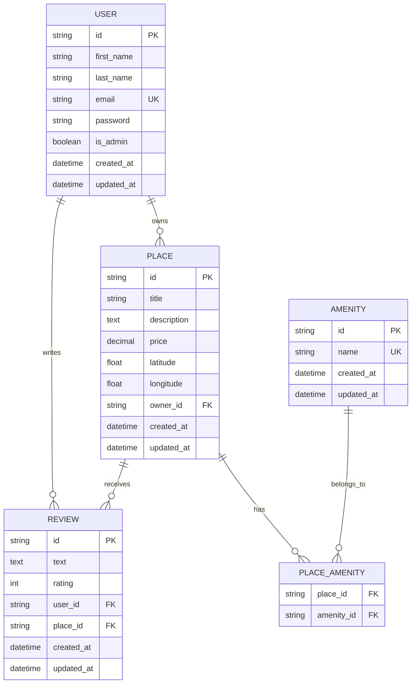

# HBnB Database Entity-Relationship Diagram

This diagram represents the database schema for the HBnB project, showing all entities and their relationships.

## Entity-Relationship Diagram

## Relationship Descriptions

### One-to-Many Relationships

1. **User to Places**: A user can own multiple places, but each place has only one owner.
   - Relationship: `USER ||--o{ PLACE`
   - Foreign Key: `places.owner_id` references `users.id`

2. **User to Reviews**: A user can write multiple reviews, but each review is written by one user.
   - Relationship: `USER ||--o{ REVIEW`
   - Foreign Key: `reviews.user_id` references `users.id`

3. **Place to Reviews**: A place can have multiple reviews, but each review is for one place.
   - Relationship: `PLACE ||--o{ REVIEW`
   - Foreign Key: `reviews.place_id` references `places.id`

### Many-to-Many Relationships

1. **Place to Amenities**: A place can have multiple amenities, and an amenity can belong to multiple places.
   - Relationship: `PLACE ||--o{ PLACE_AMENITY }o--|| AMENITY`
   - Association Table: `place_amenity` with composite primary key (`place_id`, `amenity_id`)

## Constraints and Business Rules

1. **Email Uniqueness**: Each user must have a unique email address.
2. **One Review per User per Place**: A user can only review a place once (unique constraint on `user_id`, `place_id`).
3. **Rating Range**: Reviews must have a rating between 1 and 5.
4. **Self-Review Prevention**: Business logic prevents users from reviewing their own places.
5. **Amenity Name Uniqueness**: Each amenity must have a unique name.

## Table Sizes and Data Types

- **ID Fields**: All primary keys use UUID format (CHAR(36))
- **String Fields**: VARCHAR with appropriate length limits
- **Text Fields**: TEXT for longer content (descriptions, review text)
- **Numeric Fields**: DECIMAL for monetary values, FLOAT for coordinates, INT for ratings
- **Boolean Fields**: BOOLEAN for admin flags
- **Timestamps**: DATETIME with automatic creation and update tracking